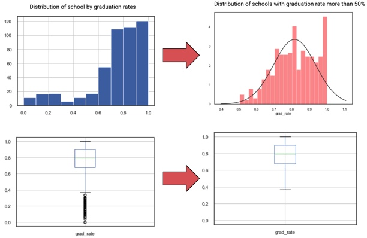
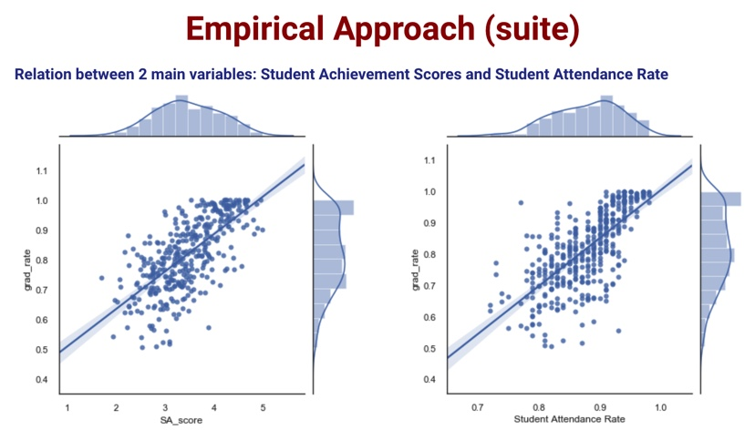

# A Multiple Variable Regression Model: Predicting Public High School Graduation Rates for NYC (2014) based on NYC Open Data
Contributors: Fabrice Mesidor and Jay Kim

August 2019

## Objective:
Identify factors that can help predict NYC public high school graduation rates.

## Questions:
 * Do demographics of a school impact student graduation rates?  If so, which attributes (gender, ethnicity, new English Learner, etc.) ?
 * Similarly, can factors pertaining to school quality or individual student achievements help predict graduation rates?

## Hypothesis:
The high rate of graduation in a school is not dependent on a discernible set of predictive factors related to the school or the students, at least on the surface.

## Sources
 * Data extracted from NYC Open Data (https://opendata.cityofnewyork.us/) in csv format, cleaned and treated using python (pandas)
 * Disclaimer: NYC Open Data format has inconsistencies (i.e., results are only as good as its source data)

## Datasets:
For the 2014-2015 School Year:
1) Graduation Rates (by individual schools), with tables for:
   * All students
   * by ELL (English Language Learner) classification
   * by SWD (Student with Disabilities) classification
   * by Ethnicity
   * by Gender
   * by Poverty classification
2) High School Quality Report, with tables for:
   * Summary of Results
   * Student Achievement Breakdown

## Data
 * 420 observations - each observation represents a school.

## Target Variable
 * High school graduation rate (% - continuous)

## Independent variables (40 after filtering)

 * Examples of categories: ethnicity - language proficiency - gender - SAT - achievement scores

## Empirical Approach

 * Transformation of target variables to consider success 
(graduation rate ≥ 50%)
 * Distribution approximates a normal distribution after change
 * It also helped to remove data that would create biases in our models

## Pinpoint correlations down to 39 Variables
 * Relationship between target variable and potential explanatory variables
 * 2 main variables have noticeably high correlation rates: Student Achievement Scores and Student Attendance Rate

Coorelation Matrix with all variables (checking for multicollinearity)

 * Since this is a Pearson Coefficient, the values near to 1 or -1 have high correlation. 
 * We drop “ethnicity probabilities” and all but one “metric score,” and then
 * We start to execute our linear regression model with the non-correlated variables.

## Modelization & Validation

 * Merged Tables
 * Added Variables
 * Modeling with transformation
 * Checking errors normality and heteroscedasticity

## Final Model
Grad_rate = 0.8649 + 0.2975 (prob Former English Language Learner) + 0.5254 (prob Not English Lanuage Learner) + 0.0086 (Student Achievement Score) + 0.018 (% Earning 10 Credits in Year 1) + 0.2235 (Supportive Environment - % Positive) + 0.0469 (Avg Grade 8 English Proficiency) + 0.4109 (% English Lanuage Learners) - 0.3683 (% in Temp Housing) + 0.6355 (Student Attendance Rate) + 0.2678 (Teacher Attendance Rate)

## Conclusions
* NYC Public High School graduation rates can be explained mainly by factors relevant to the school environment and attendance.
 * Gender and ethnicity don’t impact graduation rates in any of our models.
 * More analysis are required to find out why male/female population and other demographic attributes are not statistically significant
